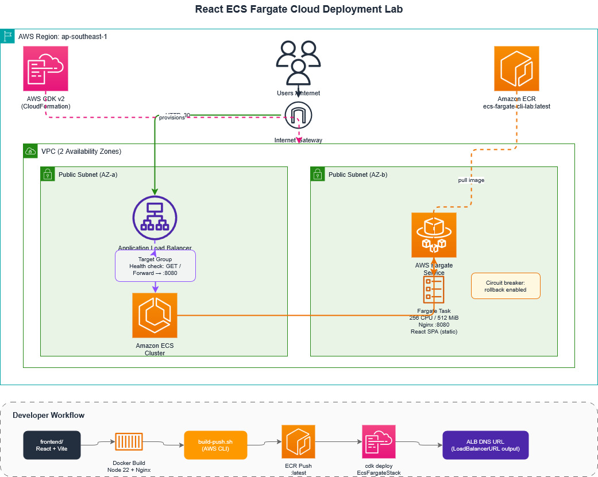

# React ECS Fargate Cloud Deployment Lab

A hands-on ecs-fargate-react infrastructure lab that deploys a containerized React single-page application to **Amazon ECS Fargate** using **AWS CDK v2**, **Docker**, and **Amazon ECR**.

The React app is built into static assets, served by Nginx inside a Docker container, pushed to ECR, and deployed behind a public **Application Load Balancer (ALB)**.

---

## Architecture



## Deployment Flow
1. Vite builds the React application into static assets.
2. A multi-stage Docker image (Node 22 build stage + Nginx runtime) is created.
3. The image is pushed to Amazon ECR using an idempotent Bash script.
4. AWS CDK provisions the infrastructure:
      .VPC (2 Availability Zones)
      .ECS Cluster
      .Fargate Service
      .Application Load Balancer (ALB)
5.The ALB routes traffic to the ECS service on port 8080.

---

## Tech Stack

| Layer | Technology |
|-------|------------|
| Frontend | React 18, TypeScript, Vite, Tailwind CSS |
| Container | Docker (multi-stage: Node 22 Alpine + Nginx Alpine) |
| Infrastructure | AWS CDK v2 (TypeScript) |
| Compute | Amazon ECS Fargate |
| Networking | Application Load Balancer, VPC (2 AZs) |
| Registry | Amazon ECR |
| CLI / Scripting | AWS CLI, Bash |

---

## Folder Structure

```bash
.
├── frontend/                  # React SPA source and Dockerfile
│   ├── src/
│   ├── public/
│   ├── Dockerfile             # Multi-stage build (Node 22 → Nginx :8080)
│   └── package.json
│
├── infrastructure/            # AWS CDK application
│   ├── bin/
│   │   └── infrastructure.ts  # CDK app entry point
│   ├── lib/
│   │   └── infrastructure-stack.ts  # VPC, ECS, ALB, ECR reference
│   ├── scripts/
│   │   └── build-push.sh      # Docker build + ECR push (idempotent)
│   ├── test/
│   └── cdk.json
│
└── README.md
```

---

## Prerequisites

Install and configure the following before deploying:

| Tool | Purpose |
|------|---------|
| [Node.js](https://nodejs.org/) (v18+) | Frontend and CDK dependencies |
| [Docker](https://www.docker.com/) | Build and push container images |
| [AWS CLI v2](https://docs.aws.amazon.com/cli/latest/userguide/getting-started-install.html) | Authenticate and interact with AWS |
| [AWS CDK CLI](https://docs.aws.amazon.com/cdk/v2/guide/getting_started.html) | Deploy infrastructure (`npm install -g aws-cdk`) |

**AWS requirements**

- An AWS account with permissions to create VPC, ECS, ECR, IAM, and CloudFormation resources
- AWS CLI configured with valid credentials:

```bash
aws configure
# AWS Access Key ID
# AWS Secret Access Key
# Default region: ap-southeast-1  (matches CDK stack configuration)
# Default output format: json
```

Verify your identity:

```bash
aws sts get-caller-identity
```

---

## Setup

### 1. Install frontend dependencies

```bash
cd frontend
npm install
cd ..
```

### 2. Install infrastructure dependencies

```bash
cd infrastructure
npm install
cd ..
```

### 3. Bootstrap CDK (first time only)

CDK bootstrap creates the resources CDK needs to deploy stacks in your account/region.

```bash
cd infrastructure
npx cdk bootstrap aws://ACCOUNT_ID/ap-southeast-1
cd ..
```

Replace `ACCOUNT_ID` with your AWS account ID, or use:

```bash
npx cdk bootstrap
```

---

## Deployment

Run these steps in order. The ECR repository must contain an image **before** the CDK stack can successfully deploy the Fargate service.

### Step 1 — Build the React app (optional local verification)

```bash
cd frontend
npm run build
cd ..
```

This produces static files in `frontend/dist/`. The Docker build runs this step automatically, but local builds are useful for catching frontend errors early.

### Step 2 — Build and push the Docker image to ECR

From the `infrastructure/scripts` directory:

```bash
cd infrastructure/scripts
bash build-push.sh
cd ../..
```

The script is idempotent. It will:

- Create the ECR repository `ecs-fargate-cli-lab` if it does not exist
- Build the Docker image from `frontend/`
- Authenticate Docker to ECR
- Tag and push the image as `:latest`

Default region: **ap-southeast-1**

### Step 3 — Deploy infrastructure with CDK

```bash
cd infrastructure
npx cdk deploy
cd ..
```

Review the CloudFormation changeset and confirm when prompted. On success, CDK outputs the load balancer URL:

```
Outputs:
EcsFargateStack.LoadBalancerURL = http://EcsFargate-xxxxxxxx.ap-southeast-1.elb.amazonaws.com
```

---

## Accessing the Application

After deployment completes, open the **LoadBalancerURL** from the CDK output in your browser:

```
http://<alb-dns-name>.ap-southeast-1.elb.amazonaws.com
```

The ALB listens on port **80** and forwards traffic to the Fargate task on container port **8080**, where Nginx serves the React SPA.

Allow a few minutes after the first deploy for the ECS service to stabilize and pass health checks.

---

## Common Issues

### ECS health check failures

**Symptoms:** Tasks start then stop; service remains in a draining or failed state.

**Likely causes:**

- Nginx is not listening on port **8080**
- The container exits before the health check succeeds
- The app returns a non-200 response on `/`

**Checks:**

```bash
# Verify the container serves HTTP 200 locally
docker build -t ecs-fargate-cli-lab frontend
docker run -p 8080:8080 ecs-fargate-cli-lab
curl -I http://localhost:8080/
```

The CDK stack configures the target group health check on path `/` expecting HTTP **200**.

### Port mismatch (80 vs 8080)

| Component | Port |
|-----------|------|
| ALB listener | 80 |
| Target group → container | 8080 |
| Nginx inside container | 8080 |

The ALB does **not** forward to port 80 inside the container. Nginx is configured to listen on **8080** (non-root user). If you change the Dockerfile port, update `containerPort` in `infrastructure/lib/infrastructure-stack.ts` to match.

### ECR image not found

**Symptoms:** ECS tasks fail with `CannotPullContainerError` or similar.

**Fix:**

1. Confirm the image exists:

```bash
aws ecr describe-images \
  --repository-name ecs-fargate-cli-lab \
  --region ap-southeast-1
```

2. Re-run the push script:

```bash
cd infrastructure/scripts
bash build-push.sh
```

3. Redeploy:

```bash
cd infrastructure
npx cdk deploy
```

The CDK stack references an existing ECR repository named `ecs-fargate-cli-lab` with the `latest` tag. Push the image before deploying.

### CDK bootstrap not run

**Symptoms:** `SSM parameter /cdk-bootstrap/... not found` or bootstrap-related errors.

**Fix:**

```bash
cd infrastructure
npx cdk bootstrap
```

---

## Cleanup

Remove resources to avoid ongoing AWS charges.

### 1. Destroy the CDK stack

```bash
cd infrastructure
npx cdk destroy
```

Confirm when prompted. This removes the VPC, ECS cluster, Fargate service, ALB, and related resources.

### 2. Delete the ECR repository

The ECR repository is created by the push script, not CDK, so it must be deleted separately:

```bash
aws ecr delete-repository \
  --repository-name ecs-fargate-cli-lab \
  --region ap-southeast-1 \
  --force
```

The `--force` flag deletes all images in the repository.

---

## Learning Outcomes

This lab covers practical DevOps and cloud skills:

- **Containerization** — Multi-stage Docker builds that separate build and runtime environments
- **Static SPA serving** — Nginx configuration with client-side routing fallback (`try_files`)
- **AWS ECS Fargate** — Serverless container orchestration without managing EC2 instances
- **Load balancing** — ALB target groups, listeners, and HTTP health checks
- **Infrastructure as Code** — Declarative AWS resources with CDK v2 and TypeScript
- **Container registry workflow** — ECR authentication, tagging, and image lifecycle
- **Deployment safety** — ECS circuit breaker with automatic rollback on failed deployments
- **Idempotent scripting** — Repeatable build/push scripts safe to run multiple times

---

## Key Configuration Reference

| Setting | Value |
|---------|-------|
| AWS Region | `ap-southeast-1` |
| ECR Repository | `ecs-fargate-cli-lab` |
| Container Port | `8080` |
| Task CPU / Memory | 256 / 512 MiB |
| Health Check Path | `/` |
| Circuit Breaker | Enabled (rollback on failure) |
| CDK Stack | `EcsFargateStack` |

---

## License

This project is intended for learning and portfolio use.
